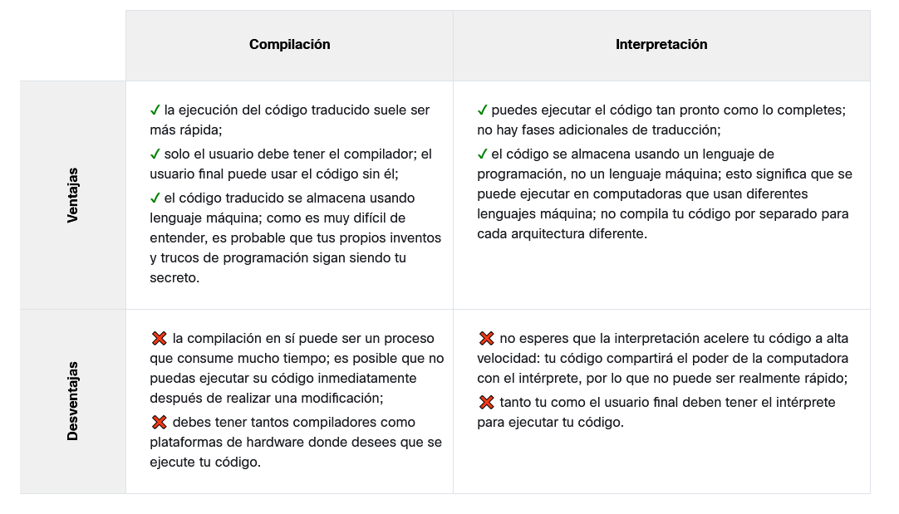

# Introducción a la programación

## 1.1.1 Como funciona un programa de computadora

Imagina que quieres saber la velocidad media que has alcanzado durante un viaje largo. Conoces la distancia, conoces el tiempo, necesitas la velocidad.

Naturalmente, la computadora podrá calcular esto, pero la computadora no es consciente de cosas como la distancia, la velocidad o el tiempo. Por lo tanto, es necesario instruir a la computadora para:

    aceptar un número que represente la distancia;
    aceptar un número que represente el tiempo de viaje;
    divide el valor anterior por el segundo y almacenar el resultado en la memoria;
    mostrar el resultado (que representa la velocidad promedio) en un formato legible.

Estas cuatro simples acciones forman un programa

## 1.1.2 Lenguajes naturales vs lenguajes de programación

- lenguaje se usa para comunicar
- no necesariamente usa palabras, por ejemplo existe el lenguaje corporal
- los computadores tienen su lenguaje de maquina.

- el computador solo responde solo a un conjunto predeterminado de comandos conocidos

- Al conjunto completo de comandos conocidos se le conoce como **lista de instrucciones (IL)**
- Cada computador puede tener sus ILs y pueden ser muy diferentes entre una y otra
- Los humanos creamos nuestros lenguajes o idiomas, cada día se crean nuevas palabras y desaparecen otras, son llamados **Lenguajes naturales**

## 1.1.3 Partes de un lenguaje

1. Un alfabeto: conjunto de símbolos para formar palabras
2. Un léxico: o diccionario, conjunto de palabras disponibles
3. Una sintaxis: conjunto de reglas formales o informales, se utiliza para precisar si una cadena de palabras forma una oración valida ejemplo:
    - valida: soy una serpiente
    - no valida: yo serpiente soy una
4. Una semántica: conjunto de reglas que determinan si una frase tiene sentido
    - valida: me comí una dona
    - no valida: una dona me comió

## 1.1.4 Lenguaje de maquina vs lenguaje de alto nivel

- IL es el alfabeto del lenguaje de maquina, los símbolos mas simples, es la lengua materna de la computadora, esta esta muy lejos de una lengua materna humana.
- Nace la necesidad de un lenguaje común o un lenguaje puente entre los humanos y los computadores
- **Lenguajes de programación de alto nivel**, los humanos lo usan para escribir programas y las computadoras para ejecutar los programas, siendo mas complejo que el lenguaje de maquina pero mas simple que el lenguaje humano.
- Un programa escrito en un lenguaje de alto nivel se denomina **código fuente**, el archivo que contiene el código fuente se denomina **archivo fuente**

## 1.1.5 Compilación vs interpretación

- la composición de los elementos del lenguaje se denomina programación informática

Por supuesto, dicha composición tiene que ser correcta en muchos sentidos:

    - alfabéticamente – un programa debe estar escrito en un alfabeto reconocible, como romano, cirílico, etc.
    - léxicamente – cada lenguaje de programación tiene su diccionario y hay que dominarlo; afortunadamente, es mucho más simple y pequeño que el diccionario de cualquier idioma natural;
    - sintácticamente – cada idioma tiene sus reglas y hay que obedecerlas;
    - semánticamente – el programa tiene que tener sentido.

luego el programa deber ser convertido en lenguaje de maquina, existen 2 formas de hacerlo

### Compilación

- El programa fuente se traduce una vez
- Cada vez que hayan cambios debe volverse a traducir
- Da como resultado un archivo ejecutable que contiene código de maquina.
- Ese ejecutable se puede distribuir
- El programa que realiza la traducción se llama **compilador** o traductor

### Interpretación

- El programa fuente es traducido cada vez que se va a ejecutar
- El programa que realiza este tipo de transformación se denomina **intérprete**
- Para poderlo distribuir se necesita distribuir el programa y el intérprete, de lo contrario no lo pueden ejecutar

## 1.1.6 ¿Qué hace el interprete?

- El programa esta en un archivo que por lo general es un archivo de texto puro
- Se invoca al interprete y este lee el archivo
- La lectura se hace de arriba a abajo, de izquierda a derecha (existen algunas excepciones)
- El interprete verifica si las líneas están correctas, aplica los 4 aspectos (en 1.1.5)
- Si el interprete encuentra algún error finaliza el trabajo inmediatamente, el resultado es un **mensaje de error!**

Si la línea se ve bien, el intérprete intenta ejecutarlo (nota: cada línea generalmente se ejecuta por separado, por lo que el trío "leer-verificar-ejecutar" se puede repetir muchas veces, más veces mas que el número real de líneas en el archivo fuente, ya que algunas partes del código puede ejecutarse más de una vez).

También es posible que una parte significativa del código pueda ejecutarse con éxito antes de que el interprete encuentra un error. Este es un comportamiento normal en este modelo de ejecución.

Puedes preguntarte ahora: ¿Cuál es mejor? ¿El modelo de "compilación" o el modelo de "interpretación"? No hay una respuesta obvia. De haberlo existido, uno de estos modelos habría dejado de existir hace mucho tiempo. Ambos tienen sus ventajas y sus desventajas.

## 1.1.7 Compilación vs interpretación, ventajas y desventajas

## **PYTHON**

- Es un lenguaje interpretado
- Para poderlo ejecutar se necesita el interprete, la ventaja es que el interprete es gratuito

**Lenguajes de scripting**: utilizados en la interpretación
**Fuente de los Programas codificados:**: se denominan **scripts**