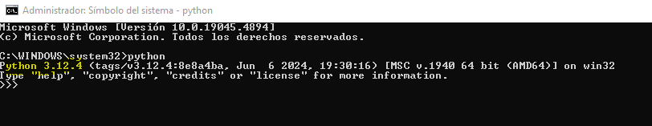
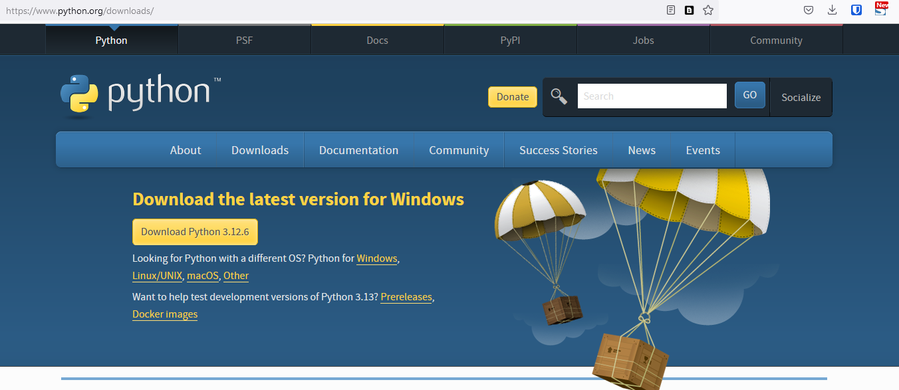
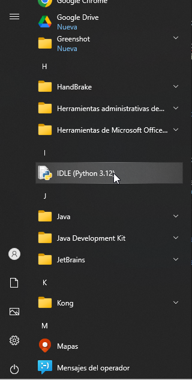
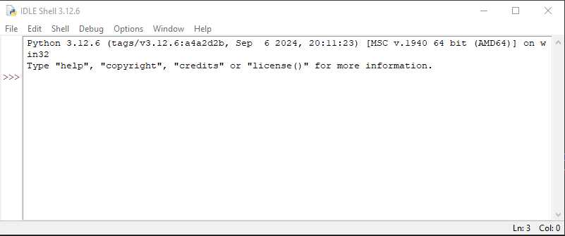
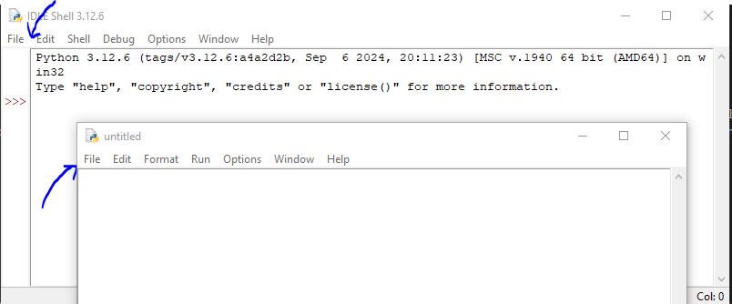
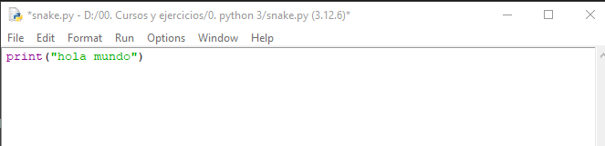
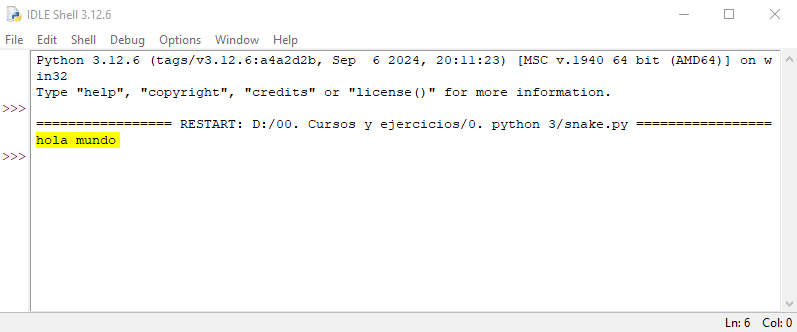
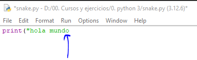
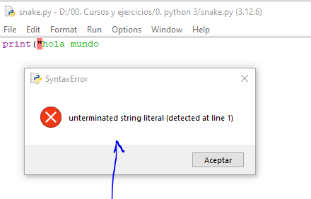
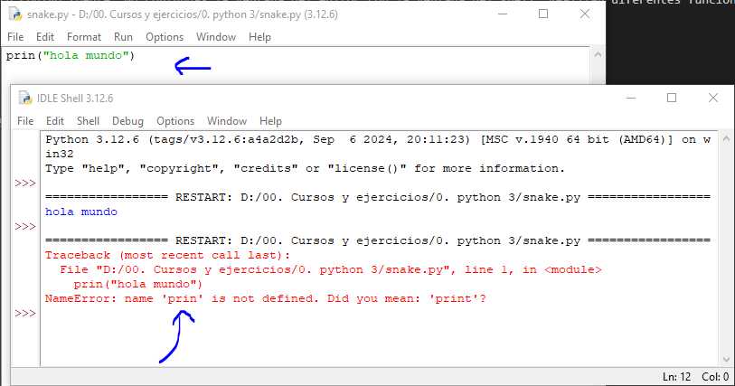

# Descarga e instalación de python

- se puede instalar python (se recomienda)
- tambien se puede correr desde Edube Interactive 


## 1.3.1 Comienza tu viaje con python

- la versión depende del sistema operativo
- linux por lo general ya tiene instalado python
- se puede ver la version instalada ejecutando "python"

en mi caso tengo la versión 3.12.4



si es necesario descargarlo se puede desde su sitio oficial:

[Descargar python/](https://www.python.org/downloads/)


## 1.3.2 Como descargar, instalar y configurar Python

- descargar la versión 3, dependiendo del sistema operativo
- Deja las configuraciones predeterminadas que el instalador sugiere por ahora, con una excepción: observa la casilla de verificación denominada Agregar Python 3.x a PATH y selecciónala.
- Si eres un usuario de macOS, es posible que ya se haya preinstalado una versión de Python 2 en tu computadora, pero como estaremos trabajando con Python 3, aún deberás descargar e instalar el archivo .pkg correspondiente desde el sitio de Python.




## 1.3.3 Comenzando tu trabajo con python

### herramientas:

- Un **editor** que te ayudará a escribir el código (debe tener algunas características especiales, no disponibles en herramientas simples); este editor dedicado te dará más que el equipo estándar del sistema operativo.
- Una **consola** en la que puedas ejecutar tu código recién escrito y detenerlo por la fuerza cuando se sale de control.
- Una herramienta llamada **depurador**, capaz de ejecutar tu código paso a paso y te permite inspeccionarlo en cada momento de su ejecución.
- se recomienda tambien un **IDLE** es un acrónimo de: Integrated Development and Learning Environment (Desarrollo Integrado y Entorno de Aprendizaje).






## 1.3.4 Tu primer programa antes de tu primer programa

- desde el IDLE en file-new file, y el idle abre la ventana del editor



- la ventana del editor. Su único propósito es ser un lugar de trabajo en el que se trate tu código fuente. No confundas la ventana del editor con la ventana del shell. Realizan diferentes funciones.
- darle nombre al archivo con file-save as: snake.py
- dentro escribir:

```python
print("hola mundo")
```
- No intentes utilizar citas tipográficas (curvadas, rizadas, etc.), utilizadas por los procesadores de texto avanzados, ya que Python no las acepta.
- Guardar el archivo con file-save
- ejecutar el programa con run-run module






## 1.3.5 Como estropear y arreglar tu código

- vamos a dañar el programa quitando el parentesis y comillas al final



- intentamos correr de nuevo el programa



dando error,

- ahora cambiar print por prin
- dando un error diferente
- Esto se debe a que la naturaleza del error es diferente y el error se descubre en una etapa diferente de interpretación



El mensaje (en rojo) muestra (en las líneas siguientes):

- el traceback (que es la ruta que recorre el código a través de diferentes partes del programa; puedes ignorarlo por ahora, ya que está vacío en un código tan simple) ;
- la ubicación del error (el nombre del archivo que contiene el error, el número de línea y el nombre del módulo); nota: el número puede ser engañoso, ya que Python suele mostrar el lugar donde notó por primera vez los efectos del error, no necesariamente el error en sí;
- el contenido de la línea errónea; nota: la ventana del editor de IDLE no muestra números de línea, pero muestra la ubicación actual del cursor en la esquina inferior derecha; utilízalo para localizar la línea errónea en un código fuente largo;
- el nombre del error y una breve explicación.