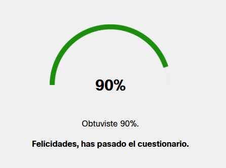
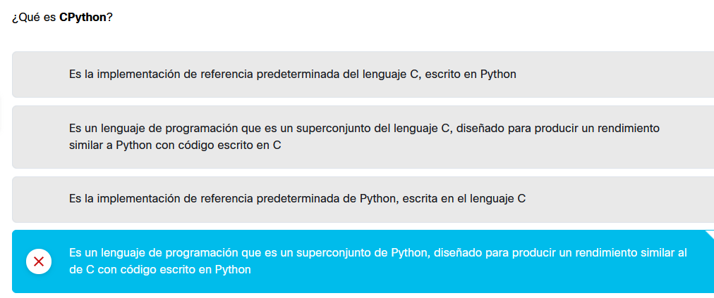

# Finalización del módulo 1

- Prueba del módulo 1
Resumen:
- los fundamentos de la programación de computadoras, es decir, cómo funciona la computadora, cómo se ejecuta el programa, cómo se utiliza el lenguaje de programación definido y construido;
- la diferencia entre compilación e interpretación;
- la información básica sobre Python y cómo se posiciona entre otros lenguajes de programación, y qué distingue a sus diferentes versiones;
cómo obtener, instalar y configurar Python en su máquina loc

- único error:

