# Primer Programa

## 2.1.1 Tu primer programa

```python
print("hola mundo")
```
archivo: ejemplo_1.py

Como puedes ver, el primer programa consta de las siguientes partes:

- La palabra print;
- Un paréntesis de apertura;
- Una comilla;
- Una línea de texto: ¡Hola, Mundo!;
- Otra comilla;
- Un paréntesis de cierre.

## La función print()

- La palabra print que puedes ver aquí es el nombre de una función

Una función (en este contexto) es una parte separada del código de computadora el cual es capaz de:

- causar algún efecto (por ejemplo, enviar texto a la terminal, crear un archivo, dibujar una imagen, reproducir un sonido, etc.); esto es algo completamente inaudito en el mundo de las matemáticas.
- evaluar un valor (por ejemplo, la raíz cuadrada de un valor o la longitud de un texto dado) y devolverlo como el resultado de la función; esto es lo que hace que las funciones de Python sean parientes de los conceptos matemáticos.

- De donde provienen las funciones?
    - De **python**: Pueden venir de Python mismo. La función print es una de este tipo; dicha función es un valor agregado de Python junto con su entorno (está integrada); no tienes que hacer nada especial (por ejemplo, pedirle a alguien algo) si quieres usarla;
    - de **Modulos**: Pueden provenir de uno o varios de los módulos; de Python llamados complementos algunos de los módulos vienen con Python, otros pueden requerir una instalación por separado - cual sea el caso, todos deben estar conectados explícitamente con el código
    - de **tu código**: Puedes escribirlas tú mismo, colocando tantas funciones como desees y necesites dentro de su programa para hacerlo más simple, claro y elegante

El nombre de la función debe ser significativo (el nombre de la función print es evidente) imprime en la terminal.

Si vas a utilizar alguna función ya existente, no podrás modificar su nombre, pero cuando comiences a escribir tus propias funciones, debes considerar cuidadosamente la elección de nombres.

## 2.1.3 Argumentos de funciones

Como se dijo anteriormente, una función puede tener:

- Un efecto;
- Un resultado

Las funciones de Python, por otro lado, son más versátiles. Dependiendo de las necesidades individuales, pueden aceptar cualquier cantidad de argumentos - tantos como sea necesario para realizar sus tareas. Nota: Cuando dijimos cualquier número, eso incluye el cero - algunas funciones de Python no necesitan ningún argumento

### Una cadena como argumento.

```python
print("hola mundo")
```
"hola mundo": es un argumento, tipo cadena, Casi cualquier cosa que ponga dentro de las comillas se tomará de manera literal, no como código, sino como datos

## 2.1.4 Invocación de funciones

```python
function_name(argument)
```

- Primero, Python comprueba si el **nombre especificado es legal** (explora sus datos internos para encontrar una función existente del nombre; si esta búsqueda falla, Python aborta el código)
- En segundo lugar, Python comprueba si los requisitos de la función para el **número de argumentos le permiten invocar la función** de esta manera (por ejemplo, si una función específica exige exactamente dos argumentos, cualquier invocación que entregue solo un argumento se considerará errónea y abortará la ejecución del código)
- Tercero, Python **deja el código por un momento y salta dentro de la función** que se desea invocar; por lo tanto, también toma los argumento(s) y los pasa a la función;
- Cuarto, la función **ejecuta el código**, provoca el efecto deseado (si lo hubiera), evalúa el (los) resultado(s) deseado(s) y termina la tarea;
- Finalmente, Python **regresa al código** (al lugar inmediatamente después de la invocación) y reanuda su ejecución


## 2.1.5 Trabajando con la función print()

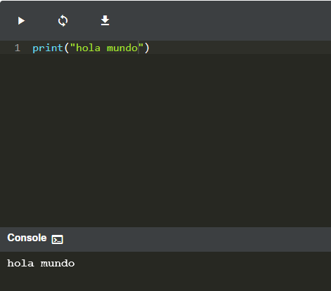

- Utiliza la función print() para imprimir la linea ¡Hola, Mundo! en la pantalla. Usa comillas dobles alrededor de la cadena.
- Habiendo hecho eso, usa la función print() nuevamente, pero esta vez imprime tu nombre.

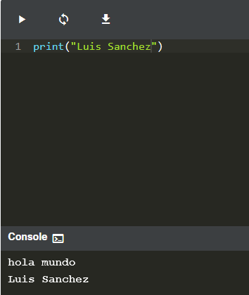

- Elimina las comillas dobles y ejecuta tu código. Mira la reacción de Python. ¿Qué tipo de error arroja?: File "main.py", line 1

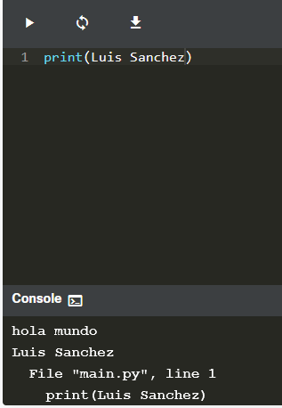

Luego, elimina los paréntesis, vuelve a colocar las comillas dobles y ejecuta tu código nuevamente. ¿Qué tipo de error arroja esta vez?: error de sintaxys


## 2.1.6 La función print() y su efecto, argumentos, y valores retornados

### 1. ¿Qué efecto tiene la función print()?

El efecto es muy útil y muy espectacular. La función:

- toma sus argumentos (puede aceptar más de un argumento y también puede aceptar menos de un argumento)
- los convierte a un formato legible si es necesario (como puedes sospechar, las cadenas no requieren esta acción, ya que la cadena ya es legible)
- envía los datos resultantes al dispositivo de salida (normalmente la consola); en otras palabras, todo lo que pongas en la función print() se aparecerá en tu pantalla.

No es de extrañar entonces que, de ahora en adelante, utilices print() muy intensamente para ver los resultados de sus operaciones y evaluaciones.

### 2. ¿Qué argumentos espera print()?

- Cualquiera. Pronto te mostraremos que print() puede operar con prácticamente todos los tipos de datos que ofrece Python. Cadenas, números, caracteres, valores lógicos, objetos - cualquiera de estos se puede pasar con éxito a print().

### 3. ¿Qué valor devuelve la función print()?

Ninguno. Su efecto es suficiente.

## 2.1.7 Instrucciones

- no debe haber mas de una instrucción por linea
- Una línea puede estar vacía (por ejemplo, puede no contener ninguna instrucción) pero no debe contener dos, tres o más instrucciones. Esto está estrictamente prohibido
- se ejecuta de arriba hacia abajo. linea por linea

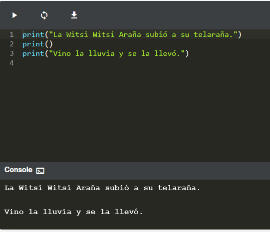

- una forma de producir una nueva línea en la consola de salida es con print()

## 2.1.8 Caracteres de escape y nueva linea en python

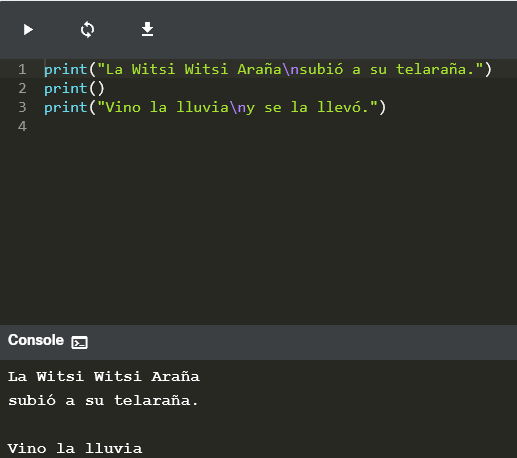

- La barra invertida (\) tiene un significado muy especial cuando se usa dentro de cadenas - se llama carácter de escape.

- La palabra escape debe entenderse específicamente - significa que la serie de caracteres en la cadena se escapa por un momento (un momento muy breve) para introducir una inclusión especial.

- En En otras palabras, la barra invertida no significa nada en sí misma, sino que es solo una especie de anuncio de que el siguiente carácter después de la barra invertida también tiene un significado diferente.

- La la letra n colocada después de la barra invertida proviene de la palabra newline.
- Tanto la barra invertida como n forman un símbolo especial llamado un carácter de nueva línea, que insta a la consola a iniciar una nueva línea de salida.

- para poder mostrar la barra invertida se usa doble

```python
print(\\)
```

## 2.1.9 Usando múltiples argumentos

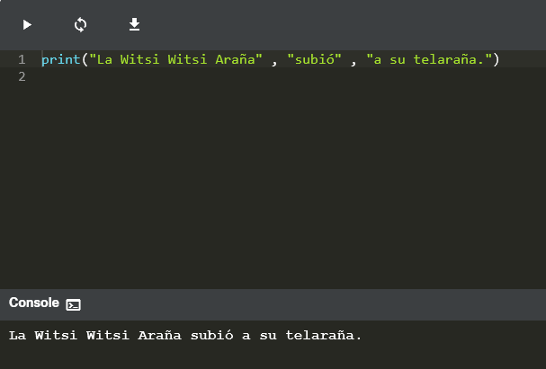


- Hay una invocación de la función print(), pero contiene tres argumentos. Todos ellos son cadenas.

- Los argumentos están separados por comas. Los hemos rodeado de espacios para hacerlos más visibles, pero no es realmente necesario, y no lo haremos más.


- La función print() invocada con más de un argumento **los muestra todos en una sola línea**.
- La función print() **pone un espacio entre los argumentos de salida** por iniciativa propia.


## 2.1.10 Argumentos posicionales

- La forma en que estamos pasando los argumentos a la función print() es la más común en Python, y se llama la forma posicional. Este nombre proviene del hecho de que el significado del argumento está dictado por su posición (por ejemplo, el segundo argumento se mostrará después del primero, no al revés).

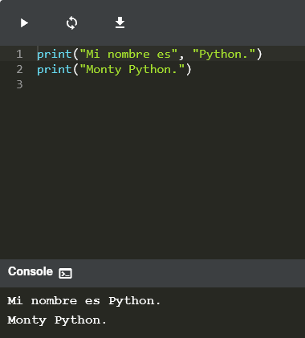


## 2.1.11 Argumentos de palabra clave

- Python ofrece otro mecanismo para el paso de argumentos, que puede ser útil cuando deseas convencer a la función print() para que cambie un poco su comportamiento.
- El mecanismo se llama argumentos de palabras clave. El nombre proviene del hecho de que el significado de estos argumentos se toma no de su ubicación (posición) sino de la palabra especial (palabra clave) utilizada para identificarlos
- La función print() tiene dos argumentos de palabra clave que puedes usar para tus propósitos. El primero se llama end.

- El comportamiento predeterminado refleja la situación en la que el argumento de palabra clave end se usa implícitamente de la siguiente manera: **end="\n"**.

En la ventana del editor puedes ver un ejemplo muy simple de cómo usar un argumento de palabra clave.

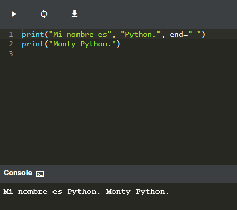

Para usarlo, es necesario conocer algunas reglas:

- Un argumento de palabra clave consta de tres elementos: una palabra clave se identifica el argumento (end aquí); un signo de igual (=); y un valor asignado a ese argumento;
- cualquier argumento de palabra clave debe colocarse después del último argumento posicional (esto es muy importante)

En nuestro ejemplo, hemos utilizado el argumento de palabra clave end, y lo hemos configurado como cadena que contiene un espacio.

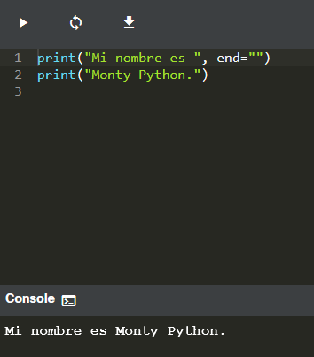

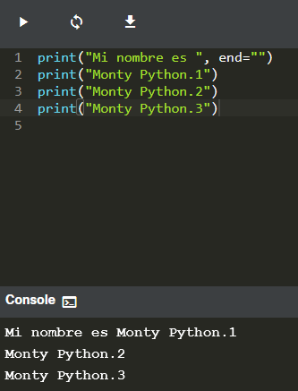

- El argumento de palabra clave que puede hacer esto se denomina sep (**como en separador**).

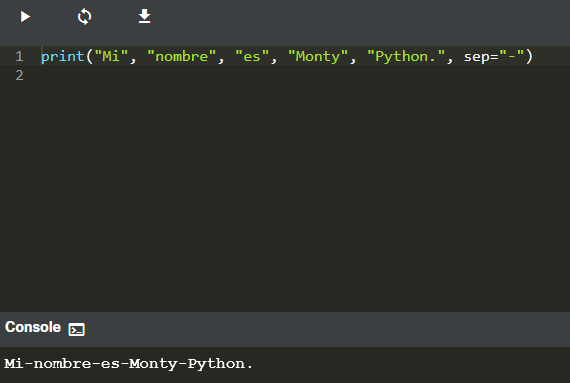

- Ambos argumentos de palabra clave pueden mezclarse en una invocación

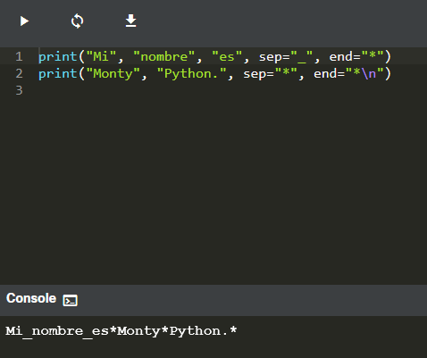


## 2.1.12 LAB: la función print() y sus argumentos

Escenario

Modifica la primera línea de código en el editor, usando las palabras claves reservadas sep y end, para que se obtenga la salida esperada. Emplea dos funciones print() en el editor.

No cambies nada en la segunda invocación del print().
Salida Esperada
```python
Programming***Essentials***in...Python
```
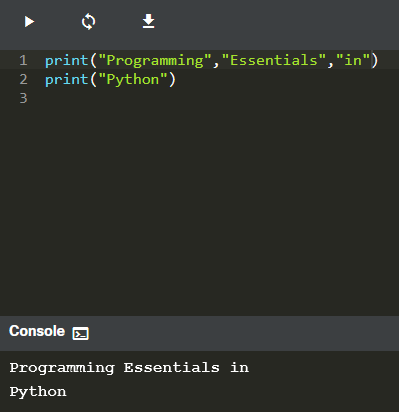

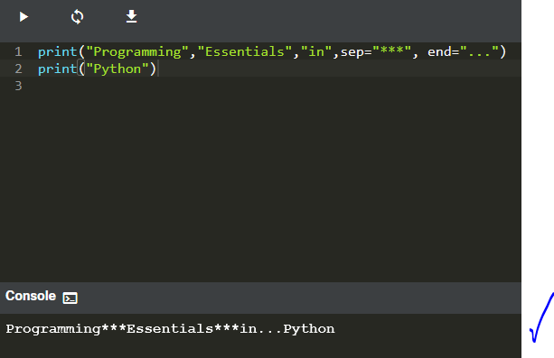


## 2.1.13 LAB: dando formato a la salida

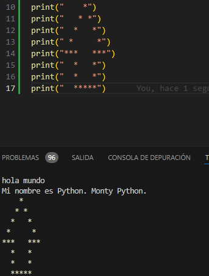

ejercicios:

- minimizar el número de invocaciones de la función print() insertando \n en las cadenas;

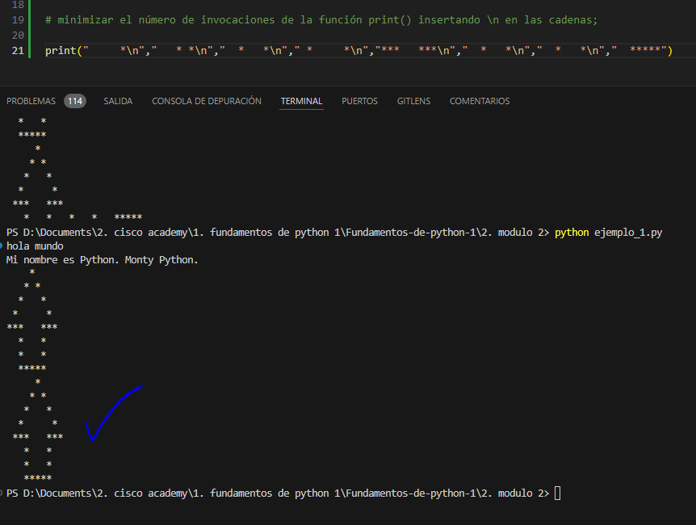


- hacer que la flecha sea el doble de grande (pero mantener las proporciones)

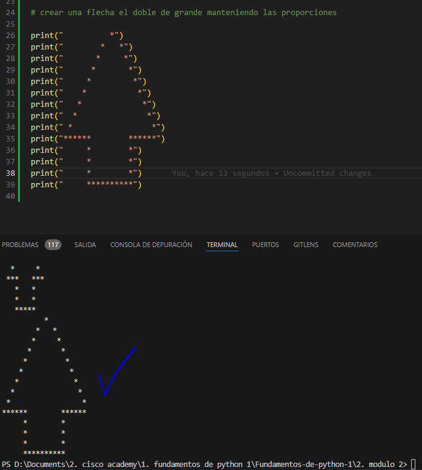

- duplica la flecha, colocando ambas flechas una al lado de la otra; nota: una cadena se puede multiplicar usando el siguiente truco: "string" * 2 producirá "stringstring" (pronto contaremos más al respecto)

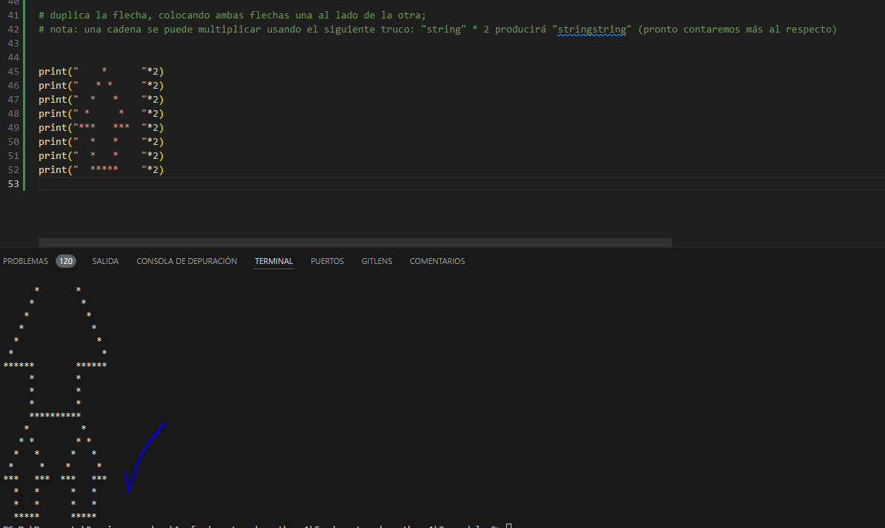

- elimina cualquiera de las comillas y observe detenidamente la respuesta de Python; presta atención a dónde Python ve un error - ¿es este el lugar donde realmente existe el error? r: da error de sintaxys en la linea 57, en la linea en la que se quitaron las comillas

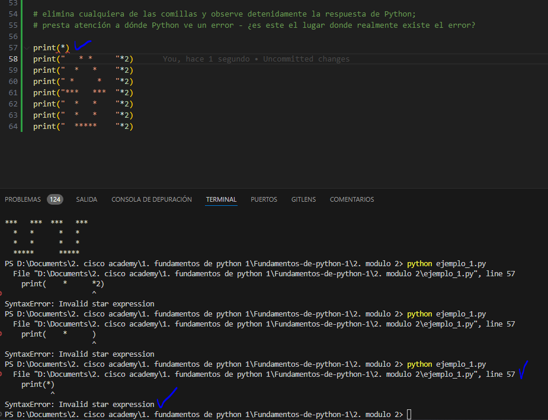


- haz lo mismo con algunos de los paréntesis;

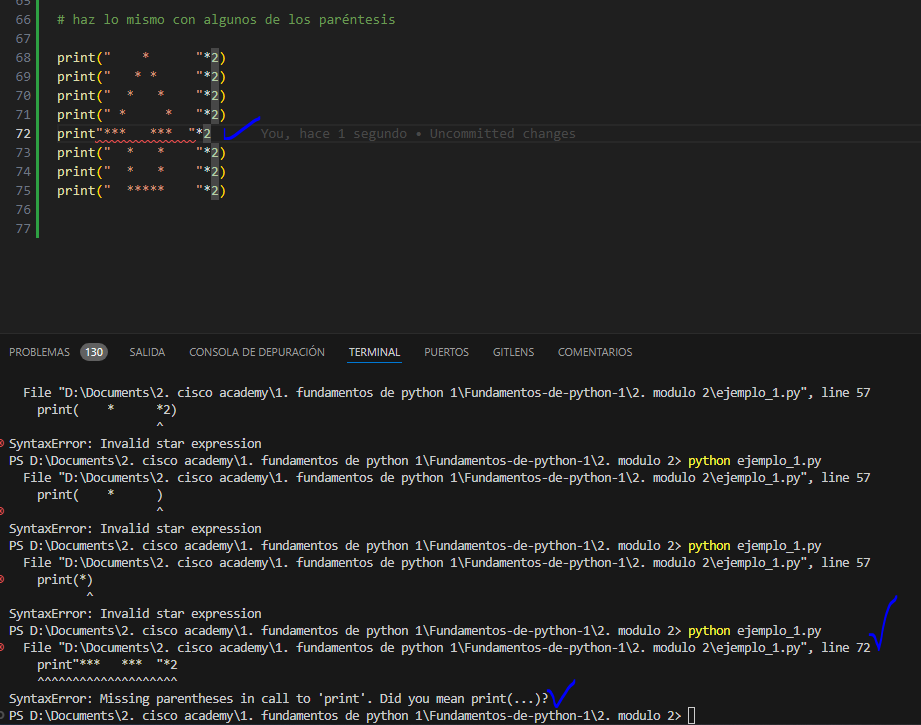

- cambia cualquiera de las palabras print por otra cosa, 
- que difiera solo en mayúsculas y minúsculas (por ejemplo, Print) - qué sucede ahora? r: da error en la linea 88 
    Traceback (most recent call last):
    File "D:\Documents\2. cisco academy\1. fundamentos de python 1\Fundamentos-de-python-1\2. modulo 2\ejemplo_1.py", line 88, in <module>
    Print("  *****    "*2)
    ^^^^^
    NameError: name 'Print' is not defined. Did you mean: 'print'?

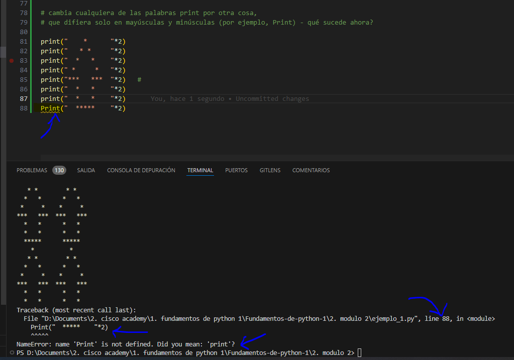

- reemplaza algunas de las comillas con apóstrofes; observa lo que sucede con cuidado, no pasa nada

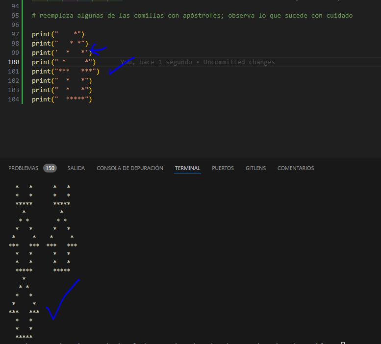

## 2.1.14 Resumen de la sección

1. La función print() es una función integrada imprime/envía un mensaje específico a la pantalla/ventana de consola.

2. Las funciones integradas, al contrario de las funciones definidas por el usuario, están siempre disponibles y no tienen que ser importadas. Python 3.7.1 viene con 69 funciones incorporadas. Puedes encontrar su lista completa en orden alfabético en **Python Standard Library.**

3. Para llamar a una función (invocación de función), debe utilizarse el nombre de la función seguido de un paréntesis. Puedes pasar argumentos a una función colocándolos dentro de los paréntesis. Se deben separar los argumentos con una coma, por ejemplo, print("¡Hola,", "Mundo!"). Una función print() "vacía" imprime una línea vacía a la pantalla.

4. Las cadenas de Python están delimitadas por comillas, por ejemplo, "Soy una cadena" (comillas dobles), o 'Yo soy una cadena, también' (comillas simples).

5. Los programas de computadora son colecciones de instrucciones. Una instrucción es un comando para realizar una tarea específica cuando se ejecuta, por ejemplo, para imprimir un determinado mensaje en la pantalla.

6. En las cadenas de Python la barra diagonal inversa (\) es un carácter especial que anuncia que el siguiente carácter tiene un significado diferente, por ejemplo, \n (el carácter de nuevalínea) comienza una nuevalínea de salida.

7. Los argumentos posicionales son aquellos cuyo significado viene dictado por su posición, por ejemplo, el segundo argumento se emite después del primero, el tercero se emite después del segundo, etc.

8. Los argumentos de palabra clave son aquellos cuyo significado no está dictado por su ubicación, sino por una palabra especial (palabra clave) que se utiliza para identificarlos.

9. Los parámetros end y sep se pueden usar para dar formato la salida de la función print(). El parámetro sep especifica el separador entre los argumentos emitidos. Por ejemplo, print("H", "E", "L", "L", "O", sep="-"), mientras que el parámetro end especifica que imprimir al final de la declaración de impresión.
