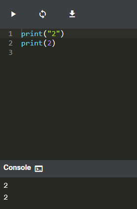

# Primer Programa

## 2.1.1 Tu primer programa

```python
print("hola mundo")
```
archivo: ejemplo_1.py


Como puedes ver, el primer programa consta de las siguientes partes:

    La palabra print;
    Un paréntesis de apertura;
    Una comilla;
    Una línea de texto: ¡Hola, Mundo!;
    Otra comilla;
    Un paréntesis de cierre.

## La función print()

- La palabra print que puedes ver aquí es el nombre de una función

Una función (en este contexto) es una parte separada del código de computadora el cual es capaz de:

- causar algún efecto (por ejemplo, enviar texto a la terminal, crear un archivo, dibujar una imagen, reproducir un sonido, etc.); esto es algo completamente inaudito en el mundo de las matemáticas.
- evaluar un valor (por ejemplo, la raíz cuadrada de un valor o la longitud de un texto dado) y devolverlo como el resultado de la función; esto es lo que hace que las funciones de Python sean parientes de los conceptos matemáticos.

- De donde provienen las funciones?
    - De **python**: Pueden venir de Python mismo. La función print es una de este tipo; dicha función es un valor agregado de Python junto con su entorno (está integrada); no tienes que hacer nada especial (por ejemplo, pedirle a alguien algo) si quieres usarla;
    - de **Modulos**: Pueden provenir de uno o varios de los módulos; de Python llamados complementos algunos de los módulos vienen con Python, otros pueden requerir una instalación por separado - cual sea el caso, todos deben estar conectados explícitamente con el código
    - de **tu código**: Puedes escribirlas tú mismo, colocando tantas funciones como desees y necesites dentro de su programa para hacerlo más simple, claro y elegante

El nombre de la función debe ser significativo (el nombre de la función print es evidente) imprime en la terminal.

Si vas a utilizar alguna función ya existente, no podrás modificar su nombre, pero cuando comiences a escribir tus propias funciones, debes considerar cuidadosamente la elección de nombres.

## 2.1.3 Argumentos de funciones

Como se dijo anteriormente, una función puede tener:

    Un efecto;
    Un resultado

Las funciones de Python, por otro lado, son más versátiles. Dependiendo de las necesidades individuales, pueden aceptar cualquier cantidad de argumentos - tantos como sea necesario para realizar sus tareas. Nota: Cuando dijimos cualquier número, eso incluye el cero - algunas funciones de Python no necesitan ningún argumento

### Una cadena como argumento.

```python
print("hola mundo")
```
"hola mundo": es un argumento, tipo cadena, Casi cualquier cosa que ponga dentro de las comillas se tomará de manera literal, no como código, sino como datos

## 2.1.4 Invocación de funciones

```python
function_name(argument)
```

- Primero, Python comprueba si el **nombre especificado es legal** (explora sus datos internos para encontrar una función existente del nombre; si esta búsqueda falla, Python aborta el código)
- En segundo lugar, Python comprueba si los requisitos de la función para el **número de argumentos le permiten invocar la función** de esta manera (por ejemplo, si una función específica exige exactamente dos argumentos, cualquier invocación que entregue solo un argumento se considerará errónea y abortará la ejecución del código)
- Tercero, Python **deja el código por un momento y salta dentro de la función** que se desea invocar; por lo tanto, también toma los argumento(s) y los pasa a la función;
- Cuarto, la función **ejecuta el código**, provoca el efecto deseado (si lo hubiera), evalúa el (los) resultado(s) deseado(s) y termina la tarea;
- Finalmente, Python **regresa al código** (al lugar inmediatamente después de la invocación) y reanuda su ejecución


## 2.1.5 Trabajando con la función print()



- Utiliza la función print() para imprimir la linea ¡Hola, Mundo! en la pantalla. Usa comillas dobles alrededor de la cadena.
- Habiendo hecho eso, usa la función print() nuevamente, pero esta vez imprime tu nombre.


- Elimina las comillas dobles y ejecuta tu código. Mira la reacción de Python. ¿Qué tipo de error arroja?: File "main.py", line 1


Luego, elimina los paréntesis, vuelve a colocar las comillas dobles y ejecuta tu código nuevamente. ¿Qué tipo de error arroja esta vez?: error de sintaxys


## 2.1.6 La función print() y su efecto, argumentos, y valores retornados

### 1. ¿Qué efecto tiene la función print()?

El efecto es muy útil y muy espectacular. La función:

- toma sus argumentos (puede aceptar más de un argumento y también puede aceptar menos de un argumento)
- los convierte a un formato legible si es necesario (como puedes sospechar, las cadenas no requieren esta acción, ya que la cadena ya es legible)
- envía los datos resultantes al dispositivo de salida (normalmente la consola); en otras palabras, todo lo que pongas en la función print() se aparecerá en tu pantalla.

No es de extrañar entonces que, de ahora en adelante, utilices print() muy intensamente para ver los resultados de sus operaciones y evaluaciones.

### 2. ¿Qué argumentos espera print()?

- Cualquiera. Pronto te mostraremos que print() puede operar con prácticamente todos los tipos de datos que ofrece Python. Cadenas, números, caracteres, valores lógicos, objetos - cualquiera de estos se puede pasar con éxito a print().

### 3. ¿Qué valor devuelve la función print()?

Ninguno. Su efecto es suficiente.

## 2.1.7 Instrucciones

