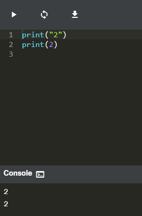

# Literales en Python

## 2.2.1 Literales - los datos en si mismos

- El dato ```123``` representa lo que el es, es decir el dato es 123
- El dato ```C``` puede representar la velocidad de la luz, o una constante, es decir no podemos determinar que es.

Entonces: ```123``` es un literal, y ```C``` no lo es



- En el código anterior Python muestra como resultado el 2, en ambos casos, aunque en uno es una cadena y en el otro es un numero. Sin embargo, internamente, la memoria de la computadora los almacena de dos maneras completamente diferentes - La cadena existe como eso solo una cadena - una serie de letras

## 2.2.2 Enteros

- enteros, es decir, aquellos que no tienen una parte fraccionaria,
- números punto-flotantes (o simplemente flotantes), los cuales contienen (o son capaces de contener) una parte fraccionaría

Tomemos por ejemplo, el número once millones ciento once mil ciento once. Si tomaras ahorita un lápiz en tu mano, escribirías el siguiente número: ```11,111,111```, o así: ```11.111.111```, incluso de esta manera: ```11 111 111.```

Es claro que la separación hace que sea más fácil de leer, especialmente cuando el número tiene demasiados dígitos. Sin embargo, Python no acepta estas cosas, está prohibido. ¿Qué es lo que Python permite?. El uso de guion bajo en los literales numéricos.*

Por lo tanto, el número se puede escribir ya sea así: ```11111111```, o como sigue: ```11_111_111```

¿Cómo se codifican los números negativos en Python? Como normalmente se hace, agregando un signo de menos. Se puede escribir: ```-11111111```, o ```-11_111_111```

### Números Octales y Hexadecimales

- Si un número entero esta precedido por un código 0O o 0o (cero-o), el número será tratado como un valor **octal**. Esto significa que el número debe contener dígitos en el rango del [0..7] únicamente. ```0o123``` es un número octal con un valor (decimal) igual a 83.

- ```0x123``` es un número **hexadecimal** con un valor (decimal) igual a 291

## 2.2.3 Flotantes

- 2.5 , -0.4

    - Nota: dos punto cinco se ve normal cuando se escribe en un programa, sin embargo si tu idioma nativo prefiere el uso de una coma en lugar de un punto, se debe asegurar que el número no contenga comas.
    - Python no lo aceptará, o (en casos poco probables) puede malinterpretar el número, debido a que la coma tiene su propio significado en Python.

- Si se quiere utilizar solo el valor de dos punto cinco, se debe escribir como se mostró anteriormente. Nota que: hay un punto entre el 2 y el 5, no una coma.
- el valor 0.4 se puede escribir como ```.4``` y el 4.0 como ```4.```

### Enteros vs Flotantes

- A simple vista ```4``` y ```4.0``` parecen ser el mismo número, pero python los ve diferentes, uno es un entero (4) y el otro es flotante (4.0)
- Python acepta **Notación científica** 
    - Por ejemplo ```300000000``` Para evitar escribir tantos ceros, los libros de texto emplean la forma abreviada, la cual probablemente hayas visto: **3 x 10<sup>8</sup>** en Python sería: ```3e8``` o ```3E8```

### Codificando Flotantes:

- Una constante de física denominada La **Constante de Planck** (denotada como h), de acuerdo con los libros de texto, tiene un valor de: 6.62607 x 10<sup>-34</sup>

Si se quisiera utilizar en un programa, se debería escribir de la siguiente manera: ```6.62607E-34```

Python siempre elige la presentación más corta del número, y esto se debe de tomar en consideración al crear literales.
```python
print(0.000000000000000000001)
# Respuesta: 1e-22
```

## 2.2.4 Cadenas

- Las cadenas se emplean cuando se requiere procesar texto (como nombres de cualquier tipo, direcciones, novelas, etc.)

Si se quiere mostrar ```Me gusta "un helado"``` como se muestran las comillas?

1. La primera se basa en el concepto ya conocido del carácter de escape

    ```python
    print("Me gusta \"Monty Python\"")
    ```

2. Python puede utilizar una apóstrofe en lugar de una comilla. Cualquiera de estos dos caracteres puede delimitar una cadena, pero para ello se debe ser consistente.

    ```python
    print('Me gusta "Monty Python"')
    ```

- Como imprimir: **I'm Monty Python.** ? como se observa hay un apostrofe

    ```python
    ## Opcion 1
    print('I\'m Monty Python.')
    # respuesta:  I'm Monty Python.

    ## Opcion 2
    print("I'm Monty Python.")
    # respuesta:  I'm Monty Python.
    ```

## 2.2.5 Valores Booleanos

El nombre proviene de George Boole (1815-1864), el autor de Las Leyes del Pensamiento, las cuales definen el Álgebra Booleana - una parte del álgebra que hace uso de dos valores: `True` y `False`, denotados como `1` y `0`.
No se pueden cambiar - se deben tomar estos símbolos como son, incluso respetando las mayúsculas y minúsculas.

## 2.2.6 LAB Literales de Python - Cadenas

Escriba un fragmento de código de una línea, utilizando la función print(), así como los caracteres de nuevalínea y de escape, para que coincida con el resultado esperado que se muestra en la salida.
Salida Esperada

    "Estoy"
    ""aprendiendo""
    """Python""" 

Respuesta:

```python
print('"Estoy"')
print('""Aprendiendo""')
print('"""Python"""')

## otra forma:

print("\"I'm\"\n\"\"learning\"\"\n\"\"\"Python\"\"\"")
````

## 2.2.7 RESUMEN DE SECCIÓN

1. Los literales son notaciones para representar valores fijos en el código. Python tiene varios tipos de literales - es decir, un literal puede ser un número por ejemplo, 123), o una cadena (por ejemplo, "Yo soy un literal.").

2. El sistema binario es un sistema numérico que emplea 2 como su base. Por lo tanto, un número binario está compuesto por 0s y 1s únicamente, por ejemplo, 1010 es 10 en decimal.
Los sistemas de numeración Octales y Hexadecimales son similares pues emplean 8 y 16 como sus bases respectivamente. El sistema hexadecimal utiliza los números decimales más seis letras adicionales.

3. Los enteros (o simplemente int) son uno de los tipos numéricos que soporta Python. Son números que no tienen una parte fraccionaria, por ejemplo, 256, o -1 (enteros negativos).

4. Los números punto-flotante (o simplemente flotantes) son otro tipo numérico que soporta Python. Son números que contienen (o son capaces de contener) una parte fraccionaria, por ejemplo, 1.27.

5. Para codificar un apóstrofe o una comilla dentro de una cadena se puede utilizar el carácter de escape, por ejemplo, 'I\'m happy.', o abrir y cerrar la cadena utilizando un conjunto de símbolos distintos al símbolo que se desea codificar, por ejemplo, "I'm happy." para codificar un apóstrofe, y 'El dijo "Python", no "typhoon"' para codificar comillas.

6. Los valores booleanos son dos objetos constantes True y False empleados para representar valores de verdad (en contextos numéricos 1 es True, mientras que 0 es False.

Extra  

Existe un literal especial más utilizado en Python: el literal None. Este literal es llamado un objeto de NoneType, y puede ser utilizado para representar la ausencia de un valor

## 2.2.8 CUESTIONARIO DE SECCIÓN

1. Pregunta 1: ¿Qué tipos de literales son los siguientes dos ejemplos?  "Hola ", "007"
    - Ambos son literales de cadena.
2. Pregunta 2: ¿Qué tipos de literales son los siguientes cuatro ejemplos? "1.5", 2.0, 528, False
    - El primero es una cadena, el segundo es un literal numérico (un flotante), el tercero es un literal numérico (un entero) y el cuarto es un literal booleano.
3. Pregunta 3: ¿Cuál es el valor decimal del siguiente número binario? 1011
    - It's 11, porque (2**0) + (2**1) + (2**3) = 11
