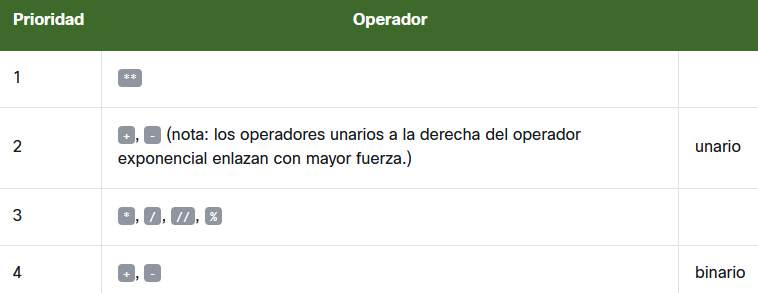

# Operadores - herramientas de manipulación de datos

## Python como una calculadora

- Python puede ser utilizado como una calculadora. No una muy útil, y definitivamente no una de bolsillo, pero una calculadora sin duda alguna

## Operadores Básicos

Un operador es un símbolo del lenguaje de programación, el cual es capaz de realizar operaciones con los valores


- **-** : 
- **+** : 
- __*__ : 
- **/** : 
- **//** : 
- **%** : 
- __**__ : 

**Exponenciación**


    Cuando ambos ** argumentos son enteros, el resultado es entero, también;
    Cuando al menos un ** argumento es flotante, el resultado también es flotante.


```python
print(2 ** 3)
print(2 ** 3.)
print(2. ** 3)
print(2. ** 3.)

## resultados
## 8
## 
## 8.0
## 
## 8.0
## 
## 8.0

```

**Multiplicación**

Un símbolo de * (asterisco) es un operador de multiplicación.

```python
print(2 * 3)
print(2 * 3.)
print(2. * 3)
print(2. * 3.)

## Resultados
## 6
## 
## 6.0
## 
## 6.0
## 
## 6.0
```

**División**

Un símbolo de / (diagonal) es un operador de división.
**El resultado producido por el operador de división siempre es flotante,**

```python	
print(6 / 3)
print(6 / 3.)
print(6. / 3)
print(6. / 3.)

## Resultados
## 2.0
## 
## 2.0
## 
## 2.0
## 
## 2.0

```

**División Entera**

Un símbolo de // (doble diagonal) es un operador de división entera. Difiere del operador estándar / en dos detalles:
- El resultado carece de la parte fraccionaria, está ausente (para los enteros), o siempre es igual a cero (para los flotantes); esto significa que los resultados siempre son redondeados;
- Se ajusta a la regla entero vs flotante.
- El resultado de la división entera siempre se redondea al valor entero inferior mas cercano del resultado de la división no redondeada.
- Esto es muy importante: el redondeo siempre va hacia abajo.

```python
print(6 // 3)
print(6 // 3.)
print(6. // 3)
print(6. // 3.)

## Resultados
## 2
## 
## 2.0
## 
## 2.0
## 
## 2.0

##***************************
## ejemplos avanzados
##**************************
print(6 // 4)
print(6. // 4)

## Resultados
## 1
## 
## 1.0

print(-6 // 4)
print(6. // -4)

## Resultados

## -2
## 
## -2.0

```

>^[!WARNING]
>Como no dividir
>Como probablemente sabes, la división entre cero no funciona.
>No intentes:
>Dividir entre cero;
>Realizar una división entera entre cero;
>Encontrar el residuo de una división entre cero.


**Residuo / Módulo**

El resultado de la operación es el residuo que queda de la división entera, % (porcentaje)

```python	
print(14 % 4)

## Resultados
## 2

print(12 % 4.5) 

## Resultados
## 3.0


```

**Suma**

El símbolo del operador de suma es el + (signo de más), el cual esta completamente alineado a los estándares matemáticos

```python
print(-4 + 4)
print(-4. + 8)
## Resultados
## 0
## 
## 4.0
```

**El operador de resta, operadores unarios y binarios**

El símbolo del operador de resta es obviamente - (el signo de menos), sin embargo debes notar que este operador tiene otra función - puede cambiar el signo de un número

```python
print(-4 - 4)
print(4. - 8)
print(-1.1)
## Resultados
## -8
## 
## -4.0
## 
## -1.1

```

## Operadores y sus prioridades

El fenómeno que causa que algunos operadores actúen antes que otros es conocido como la jerarquía de prioridades.

```python
print( 2 + 3 * 5 )
## Resultado
## 17
```

**Operadores y sus enlaces**

El enlace de un operador determina el orden en que se computan las operaciones de los operadores con la misma prioridad, los cuales se encuentran dentro de una misma expresión.
La mayoría de los operadores de Python tienen un **enlazado hacia la izquierda**, lo que significa que el cálculo de la expresión es realizado de izquierda a derecha.

```python
print(9 % 6 % 2)
## Resultado
## se ejecuta de izquierda a derecha, ya que el operador % se enlaza por la izquierda
## 1

## El operador ** se enlaza por lo derecha
print(2 ** 2 ** 3)
## Resultado
## 256

##
print(-3 ** 2)
print(-2 ** 3)
print(-(3 ** 2))
## Resultados el operador de exponenciación utiliza enlazado del lado derecho
## -9
## 
## -8
## 
## -9

## 
print(2 * 3 % 5)
## Respuesta
## 1

```
Lista de prioridades



**Operadores y paréntesis**

De acuerdo con las reglas aritméticas, las sub-expresiones dentro de los paréntesis siempre se calculan primero

```python
print((5 * ((25 % 13) + 100) / (2 * 13)) // 2)
## Resultado
## 10.0
```
## RESUMEN DE SECCIÓN

Puntos Clave

1. Una expresión es una combinación de valores (o variables, operadores, llamadas a funciones, aprenderás de ello pronto) las cuales son evaluadas y dan como resultado un valor, por ejemplo, 1 + 2.

2. Los operadores son símbolos especiales o palabras clave que son capaces de operar en los valores y realizar operaciones matemáticas, por ejemplo, el * multiplica dos valores: x * y.

3. Los operadores aritméticos en Python: + (suma), - (resta), * (multiplicación), / (división clásica: regresa un flotante siempre), % (módulo: divide el operando izquierdo entre el operando derecho y regresa el residuo de la operación, por ejemplo, 5 % 2 = 1), ** (exponenciación: el operando izquierdo se eleva a la potencia del operando derecho, por ejemplo, 2 ** 3 = 2 * 2 * 2 = 8), // (división entera: retorna el número resultado de la división, pero redondeado al número entero inferior más cercano, por ejemplo, 3 // 2.0 = 1.0)

4. Un operador unario es un operador con solo un operando, por ejemplo, -1, o +3.

5. Un operador binario es un operador con dos operandos, por ejemplo, 4 + 5, o 12 % 5.

6. Algunos operadores actúan antes que otros, a esto se le llama - jerarquía de prioridades:

    El operador ** (exponencial) tiene la prioridad más alta;
    Posteriormente los operadores unarios + y - (nota: los operadores unarios a la derecha del operador exponencial enlazan con mayor fuerza, por ejemplo 4 ** -1 es igual a 0.25)
    Después *, /, //, y %,
    Finalmente, la prioridad más baja: los operadores binarios + y -.

7. Las sub-expresiones dentro de paréntesis siempre se calculan primero, por ejemplo,  15 - 1 * ( 5 *( 1 + 2 ) ) = 0.

8. Los operadores de exponenciación utilizan enlazado del lado derecho, por ejemplo, 2 ** 2 ** 3 = 256.

## CUESTIONARIO DE SECCIÓN

```python
## 1.
print((2 ** 4), (2 * 4.), (2 * 4))
## 16 8.0 8

## 2.
print((-2 / 4), (2 / 4), (2 // 4), (-2 // 4))
## -0.5 0.5 0 -1

## 3.
print((2 % -4), (2 % 4), (2 ** 3 ** 2))
## -2 2 512
```