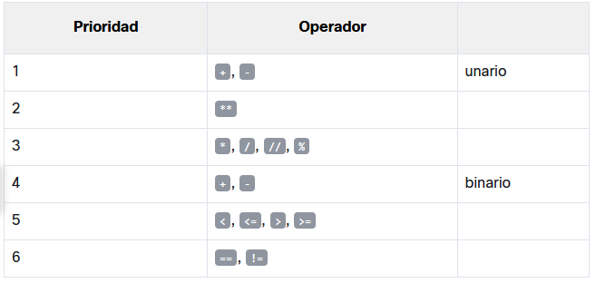
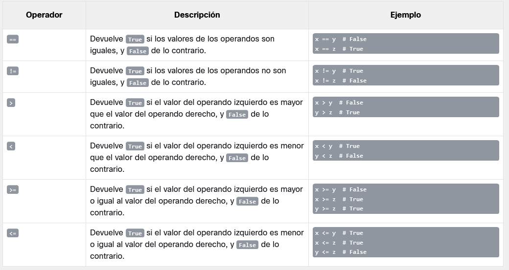

## 1 Preguntas y Respuestas

las computadoras solo conocen dos tipos de respuestas:

- Si, es cierto.
- No, esto es falso.

## 2 Comparación: operador de igualdad

¿son dos valores iguales?
Para hacer esta pregunta, se utiliza el `==` (igual igual) operador.
Es un operador binario con enlazado del lado izquierdo. Necesita dos argumentos y verifica si son iguales.

## 3 Ejercicios

Pregunta #1: ¿Cuál es el resultado de la siguiente comparación? 2 == 2
R: True

Pregunta #2: ¿Cuál es el resultado de la siguiente comparación? 2 == 2.
R: True, python puede convertir en entero en 2. y hacer la comparación

Pregunta #3: ¿Cuál es el resultado de la siguiente comparación? 1 == 2
R: False

## 4 Operadores

### Usando en operador `==` es igual a

```python
var = 0  # Asignando 0 a var
print(var == 0)

var = 1  # Asignando 1 a var
print(var == 0)

# Resultado
# True
# False

```

### Usando el operador `!=` no es igual

```python
var = 0  # Asignando 0 a var
print(var != 0)

var = 1  # Asignando 1 a var
print(var != 0)

# Resultado
# False
# True
```

### Usando el operador `>` mayor que 

```python
black_sheep > white_sheep  # Mayor que

# True lo confirma, False lo niega
```

### Usando el operador `>=` mayor igual que 

```python
centigrade_outside >= 0.0  # Mayor o igual que
```

### Usando el operador `<=` menor igual que 

```python
current_velocity_mph < 85  # Menor que
current_velocity_mph <= 85  # Menor o igual que

# la primera pregunta es estricta, la segunda no
```

## 5 Haciendo uso de las respuestas

Una vez que se tiene la respuesta se pueden hacer dos cosas:

1. Guardar el resultado en una Variable, para después usar la variable
2. Tomar una decisión tomando como base la respuesta



## 6 LAB Variables ‒ Preguntas y Respuestas

Usando uno de los operadores de comparación en Python, escribe un programa simple de dos líneas que tome el parámetro n como entrada, que es un entero, e imprime False si n es menor que 100, y True if n es mayor o igual que 100.
No debes crear ningún bloque if (hablaremos de ellos muy pronto). Prueba tu código usando los datos que te proporcionamos.

```python
n=int(input("Ingrese el valor de n: "))
print(n>=100)

## Resultado
## 55 -> false
## 99 -> false
## 100 -> true
## 101 -> true
```

## 7 Condiciones y ejecución condicional

```python
if true_or_not:
    do_this_if_true 
```

Esta sentencia condicional consta de los siguientes elementos, estrictamente necesarios en este orden:

- La palabra clave reservada if;
- Uno o más espacios en blanco;
- Una expresión (una pregunta o una respuesta) cuyo valor se interpretar únicamente en términos de True (cuando su valor no sea cero) y False (cuando sea igual a cero);
- Unos dos puntos seguidos de una nuevalínea;
- Una instrucción con sangría o un conjunto de instrucciones (se requiere absolutamente al menos una instrucción); la sangría se puede lograr de dos maneras: insertando un número particular de espacios (la recomendación es usar cuatro espacios de sangría), o usando el tabulador; nota: si hay mas de una instrucción en la parte con sangría, la sangría debe ser la misma en todas las líneas; aunque puede parecer lo mismo si se mezclan tabuladores con espacios, es importante que todas las sangrías sean exactamente iguales Python 3 no permite mezclar espacios y tabuladores para la sangría- 

```python
if the_weather_is_good:
    go_for_a_walk()
have_lunch()

## otro ejemplo

if sheep_counter >= 120: # Evaluar una expresión condicional
    sleep_and_dream() # Ejecutar si la expresión condicional es verdadera

## otro ejemplo

if sheep_counter >= 120:
    make_a_bed()
    take_a_shower()
    sleep_and_dream()
feed_the_sheepdogs()

## ahora if - else
if true_or_false_condition:
    perform_if_condition_true
else:
    perform_if_condition_false

## otro ejemplo
if the_weather_is_good:
    go_for_a_walk()
else:
    go_to_a_theater()
have_lunch()

## otro ejemplo
if the_weather_is_good:
    go_for_a_walk()
    have_fun()
else:
    go_to_a_theater()
    enjoy_the_movie()
have_lunch()

## if-else anidadas

if the_weather_is_good:
    if nice_restaurant_is_found:
        have_lunch()
    else:
        eat_a_sandwich()
else:
    if tickets_are_available:
        go_to_the_theater()
    else:
        go_shopping()

## con else if -> elif en cascada

if the_weather_is_good:
    go_for_a_walk()
elif tickets_are_available:
    go_to_the_theater()
elif table_is_available:
    go_for_lunch()
else:
    play_chess_at_home()

```

- No debes usar else sin un if precedente;
- else siempre es la última rama de la cascada, independientemente de si has usado elif o no;
- else es una parte opcional de la cascada, y puede omitirse;
- Si hay una rama else en la cascada, solo se ejecuta una de todas las ramas;
- Si no hay una rama else, es posible que no se ejecute ninguna de las opciones disponibles.- 

## 8 Análisis de muestras de código

**Problema:** encuentran el número mayor de una serie de números y lo imprimen

```python
# Se leen dos números
number1 = int(input("Ingresa el primer número: "))
number2 = int(input("Ingresa el segundo número: "))

# Elige el número más grande
if number1 > number2:
    larger_number = number1
else:
    larger_number = number2

# Imprime el resultado
print("El número más grande es:", larger_number)

##********* caso 2

# Se leen dos números
number1 = int(input("Ingresa el primer número: "))
number2 = int(input("Ingresa el segundo número: "))

# Elige el número más grande
# si alguna de las ramas de if-elif-else contiene una sola instrucción, puedes codificarla de forma más completa (no es necesario que aparezca una línea con sangría después de la palabra clave), pero solo continúa la línea después de los dos puntos).
if number1 > number2: larger_number = number1
else: larger_number = number2

# Imprime el resultado
print("El número más grande es:", larger_number)

## ********* caso 3

# Se leen tres números
number1 = int(input("Ingresa el primer número: "))
number2 = int(input("Ingresa el segundo número: "))
number3 = int(input("Ingresa el tercer número: "))

# Asumimos temporalmente que el primer número
# es el más grande.
# Lo verificaremos pronto.
largest_number = number1

# Comprobamos si el segundo número es más grande que el mayor número actual
# y actualiza el número más grande si es necesario.
if number2 > largest_number:
    largest_number = number2

# Comprobamos si el tercer número es más grande que el mayor número actual
# y actualiza el número más grande si es necesario.
if number3 > largest_number:
    largest_number = number3

# Imprime el resultado.
print("El número más grande es:", largest_number)

```

## 9 Pseudocódigo e introducción a los bucles

En este caso, utilizaremos un tipo de notación que no es un lenguaje de programación real (no se puede compilar ni ejecutar), pero está formalizado, es conciso y se puede leer. Se llama pseudocódigo.

```python
largest_number = -999999999
number = int(input())
if number == -1:
    print(largest_number)
    exit()
if number > largest_number:
    largest_number = number
# Ir a la línea 02
```

usando una función incluida en python

```python
# Se leen tres números.
number1 = int(input("Ingresa el primer número: "))
number2 = int(input("Ingresa el segundo número: "))
number3 = int(input("Ingresa el tercer número: "))

# Verifica cuál de los números es el mayor
# y pásalo a la variable largest_number.

largest_number = max(number1, number2, number3)

# Imprime el resultado.
print("El número más grande es:", largest_number)

# para el mas pequeño se puede usar min()
```

## 10 LAB Operadores de comparación y ejecución condicional

Escribe un programa que utilice el concepto de ejecución condicional, tome una cadena como entrada y que:

- imprima el enunciado "Si - ¡El Espatifilo! es la mejor planta de todos los tiempos!" en la pantalla si la cadena ingresada es "ESPATIFILIO" (mayúsculas)
- imprima "No, ¡quiero un gran Espatifilo!" si la cadena ingresada es "espatifilo" (minúsculas)
- imprima "¡Espatifilo!, ¡No [entrada]!" de lo contrario. Nota: [entrada] es la cadena que se toma como entrada.

```python
entrada=input("ingrese la entrada: ")
if entrada == "ESPATIFILIO":
    respuesta="Si - ¡El Espatifilo! es la mejor planta de todos los tiempos!"
elif entrada == "espatifilio":
    respuesta="No, ¡quiero un gran Espatifilo!"
else: respuesta="¡Espatifilo!, ¡No "+entrada+" !"
print(respuesta)
```

## 11 LAB Fundamentos de la sentencia if-else

Érase una vez una tierra de leche y miel - habitada por gente feliz y próspera. La gente pagaba impuestos, por supuesto - su felicidad tenía límites. El impuesto más importante, denominado Impuesto Personal de Ingresos (IPI, para abreviar) tenía que pagarse una vez al año y se evaluó utilizando la siguiente regla:

- si el ingreso del ciudadano no era superior a 85,528 pesos, el impuesto era igual al 18% del ingreso menos 556 pesos y 2 centavos (esta fue la llamada exención fiscal).
- si el ingreso era superior a esta cantidad, el impuesto era igual a 14,839 pesos y 2 centavos, más el 32% del excedente sobre 85,528 pesos.

Tu tarea es escribir una calculadora de impuestos.

- Debe aceptar un valor de punto flotante: el ingreso.
- A continuación, debe imprimir el impuesto calculado, redondeado a pesos totales. Hay una función llamada round() que hará el redondeo por ti - la encontrarás en el código de esqueleto del editor.- 

Nota: este país feliz nunca devuelve dinero a sus ciudadanos. Si el impuesto calculado es menor que cero, solo significa que no hay impuesto (el impuesto es igual a cero). Ten esto en cuenta durante tus cálculos.

```python
income = float(input("Introduce el ingreso anual: "))

if income < 85528:
	tax = income * 0.18 - 556.02
# Escribe tu código aquí.

tax = round(tax, 0)
print("El impuesto es:", tax, "pesos")
```

Solución:

```python
income = float(input("Introduce el ingreso anual: "))

if income < 85528:
	tax = income * 0.18 - 556.02
else: tax= 14839.02 + 0.32*(income-85528)
# Escribe tu código aquí.

tax = round(tax, 0)
if tax<0.0: tax=0.0
print("El impuesto es:", tax, "pesos")
```

## 12 LAB Fundamentos de la sentencia if-elif-else

Como seguramente sabrás, debido a algunas razones astronómicas, el año puede ser bisiesto o común. Los primeros tienen una duración de 366 días, mientras que los últimos tienen una duración de 365 días.

Desde la introducción del calendario Gregoriano (en 1582), se utiliza la siguiente regla para determinar el tipo de año:

- si el número del año no es divisible entre cuatro, es un año común.
- de lo contrario, si el número del año no es divisible entre 100, es un año bisiesto.
- de lo contrario, si el número del año no es divisible entre 400, es un año común.
- de lo contrario, es un año bisiesto.

Observa el código en el editor - solo lee un número de año y debe completarse con las instrucciones que implementan la prueba que acabamos de describir.

El código debe mostrar uno de los dos mensajes posibles, que son Año Bisiesto o Año Común, según el valor ingresado.

Sería bueno verificar si el año ingresado cae en la era Gregoriana y emitir una advertencia de lo contrario: No dentro del período del calendario Gregoriano. Consejo: utiliza los operadores != y %.

```python
year = int(input("Introduce un año: "))

if year < 1582:
	print("No esta dentro del período del calendario Gregoriano")
else:
    #  Escribe el bloque if-elif-elif-else aquí.
```

Solución:

```python
year = int(input("Introduce un año: "))

if year < 1582:
	print("No esta dentro del período del calendario Gregoriano")
else:
	if year % 4 != 0:
		print("Año Común")
	elif year % 100 != 0:
		print("Año Bisiesto")
	elif year % 400 != 0:
		print("Año Común")
	else:
		print("Año Bisiesto")
```

## 13 RESUMEN DE SECCIÓN

Los operadores de comparación (o también denominados operadores relacionales) se utilizan para comparar valores. La siguiente tabla ilustra cómo funcionan los operadores de comparación, asumiendo que
x = 0, y = 1, y z = 0:



## 14 QUIZ DE SECCIÓN

Pregunta 1: ¿Cuál es el resultado del siguiente fragmento de código?

```python
x = 5
y = 10
z = 8
 
print(x > y)
print(y > z) 

# Resultado
# false
# true
```

Pregunta 2: ¿Cuál es el resultado del siguiente fragmento de código?

```python
x, y, z = 5, 10, 8
 
print(x > z)
print((y - 5) == x) 

# Resultado
# False
# True
```

Pregunta 3: ¿Cuál es el resultado del siguiente fragmento de código?

```python
x, y, z = 5, 10, 8
x, y, z = z, y, x
 
print(x > z)
print((y - 5) == x) 

# Resultado
# True
# False
```

Pregunta 4: ¿Cuál es el resultado del siguiente fragmento de código?

```python
x = 10
 
if x == 10:
    print(x == 10)
if x > 5:
    print(x > 5)
if x < 10:
    print(x < 10)
else:
    print("else") 

# resultado
# True
# True
# else
```

Pregunta 5: ¿Cuál es el resultado del siguiente fragmento de código?

```python
x = "1"
 
if x == 1:
    print("one")
elif x == "1":
    if int(x) > 1:
        print("two")
    elif int(x) < 1:
        print("three")
    else:
        print("four")
if int(x) == 1:
    print("five")
else:
    print("six") 

# Resultado
# four
# five
```

Pregunta 6: ¿Cuál es el resultado del siguiente fragmento de código?

```python
x = 1
y = 1.0
z = "1"
 
if x == y:
    print("one")
if y == int(z):
    print("two")
elif x == y:
    print("three")
else:
    print("four") 

# Resultado
# one
# two
```