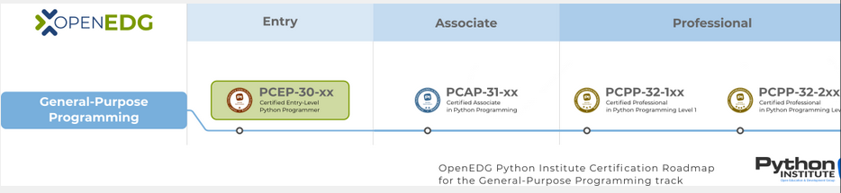

# Fundamentos-de-python-1
Curso Cisco Networking Academy

En este curso aprenderás:

    Los conceptos universales de la programación informática;
    La sintaxis y la semántica del lenguaje Python;
    Habilidades prácticas para resolver desafíos típicos de implementación;
    Cómo utilizar los elementos más importantes de la biblioteca estándar de Python;
    Cómo instalar tu entorno de ejecución;
    Cómo diseñar, desarrollar, probar y depurar programas simples de Python.

El curso se divide en cuatro módulos:

    Módulo 1
    Introducción a Python y programación informática;
    Módulo 2
    Tipos de datos, variables, operaciones básicas de entrada-salida y operadores básicos;
    Módulo 3
    Valores booleanos, ejecución condicional, bucles, listas y procesamiento de listas, operaciones lógicas y bit a bit;
    Módulo 4
    Funciones, tuplas, diccionarios, excepciones y procesamiento de datos.

Prepárate para el examen PCEP-30-0x

